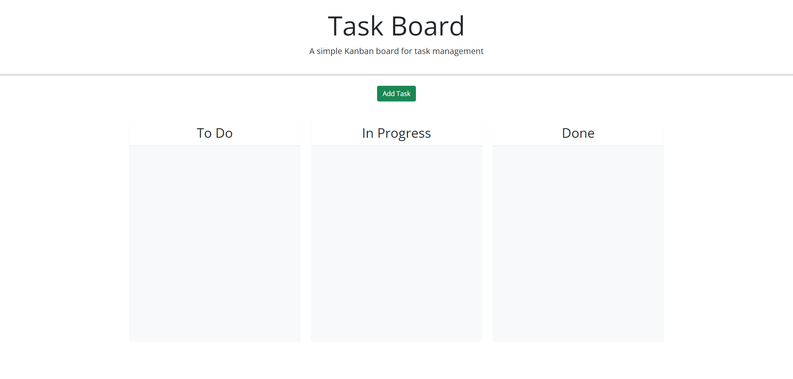
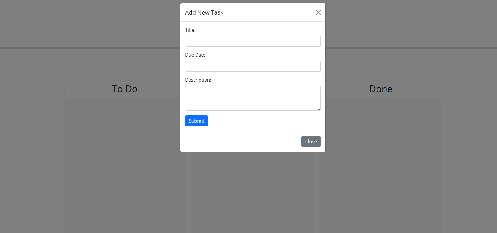

# SIMPLE TASKBOARD

## Intro 
This is a single webpage application that serves as an interactive taskboard. There are three sections, to-do, in-progress, and done. Task cards are color-coded by due date.

## Usage 
Clicking the 'Add Task' button will bring up a modal with three forms to fill out: A task title, a due date, and a description. Clicking the 'submit' button will create a task card, initially pinned onto the 'to-do' section. Users can click and drag the card into other sections based on the activity status of the task. Each card has a delete button that will erase the task from both the local storage and the task board.

# URLs
[Github Repo](https://github.com/aharper2568/simple-taskboard) \
[Live URL](https://aharper2568.github.io/simple-taskboard/)

# Screenshots

# Author and Contributors

Coded in VScode by **Anthony Harper**

[Map method used to iterate through tasks and update their status](https://developer.mozilla.org/en-US/docs/Web/JavaScript/Reference/Global_Objects/Array/map)

[.closest method used to grab the nearby element class and id of lane and to-do sections](https://api.jquery.com/closest/)